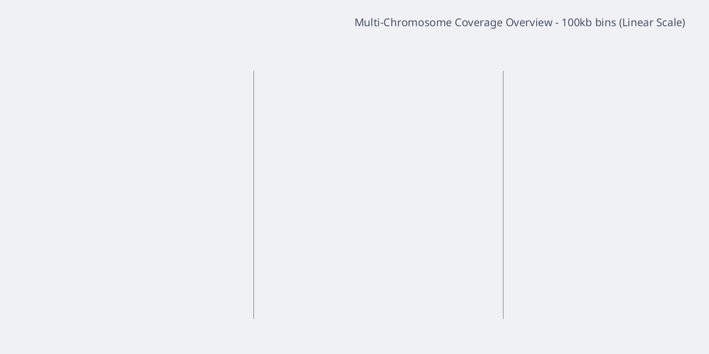
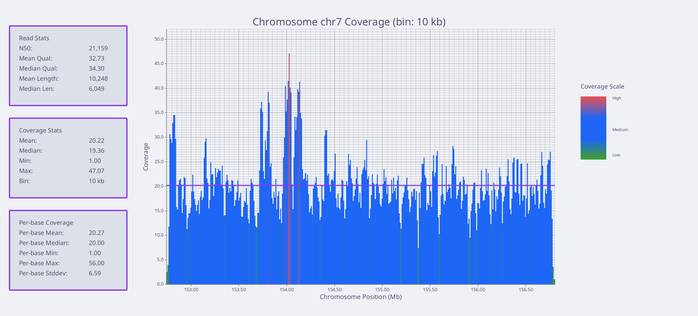
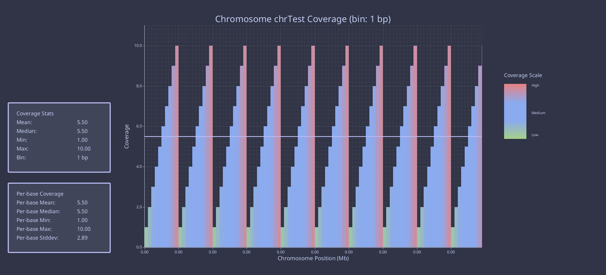
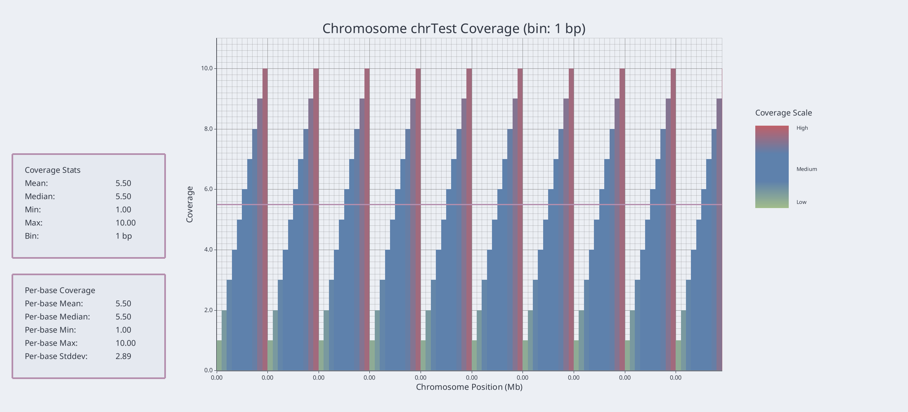

# NanoCov

NanoCov is a high-performance tool for calculating and visualizing genomic coverage from BAM files. It's designed to efficiently process large datasets and generate publication-quality plots of per-base coverage across chromosomes.



## Coverage Visualization

### Multi-Chromosome Overview

One of NanoCov's standout features is the genome-wide coverage visualization that shows all chromosomes in a single plot. This makes it easy to:

- Compare coverage across all chromosomes at a glance
- Identify regions with abnormally high or low coverage
- Visualize coverage patterns across the entire genome
- Detect chromosomal aneuploidy or large structural variations

The plot automatically sorts chromosomes in natural order (1-22, X, Y, MT) and color-codes coverage levels using a gradient color scheme that highlights variations.

### Per-Chromosome Detailed View

For in-depth analysis, NanoCov generates detailed per-chromosome plots with comprehensive statistics:



These detailed plots include:
- Per-base coverage profile with color gradient indicating coverage depth
- Read statistics panel showing N50, quality metrics, and length distribution
- Coverage statistics including mean, median, and standard deviation
- Automatic binning for optimal visualization of regions of any size

## Features

- **Fast**: Parallel processing of BAM files for high throughput
- **Flexible**: Analyze whole genomes or specific regions defined by BED files
- **Informative**: Detailed statistics including mean, median, N50, and more
- **Visual**: Publication-quality plots with multiple color themes
- **Scalable**: Handles large genomes with adaptive binning
- **Versatile**: Supports both per-chromosome and genome-wide visualizations
- **Insightful**: Extracts meaningful statistics including N50, mean/median coverage

## Installation

### From Source

```bash
cargo install --git https://github.com/yourusername/nanocov
```

### Requirements

- Rust 1.70 or newer
- Samtools (for BAM indexing)

## Quick Start

```bash
# Index your BAM file (if not already indexed)
samtools index your_data.bam

# Run basic coverage analysis
nanocov -i your_data.bam -o coverage_results

# Analyze specific regions from a BED file
nanocov -i your_data.bam -b regions.bed -o region_coverage

# Use logarithmic scale for genome-wide plot
nanocov -i your_data.bam --log-scale -o log_coverage

# Generate cramino-like statistics
nanocov -i your_data.bam --cramino
```

## Usage

```
USAGE:
    nanocov -i <INPUT> [OPTIONS]

OPTIONS:
    -i, --input <FILE>         Input BAM file
    -b, --bed <FILE>           BED file with regions to include
    --chrom-bed <FILE>         BED file with full chromosome ranges
    -o, --output <FILE>        Output file path [default: coverage.tsv]
    -t, --threads <NUM>        Number of threads [default: half of available cores]
    -c, --chunk-size <NUM>     Chunk size for parallel processing [default: 10000]
    --theme <THEME>            Color theme [latte, frappe, nord, gruvbox]
    --svg                      Use SVG output format for plots
    --cramino                  Generate cramino-like output
    --cramino-output <FILE>    Path for cramino output file [default: input.cramino]
    --genome-size <NUM>        Genome size in base pairs (for coverage calculation)
    --show-zeros               Show regions with zero coverage in plots
    --log-scale                Use logarithmic scale for multi-chromosome plot
    --no-plot                  Skip plotting (generate only TSV output)
    --no-multi-plot            Skip multi-chromosome summary plot
    -h, --help                 Print help information
```

# Outputs

For an input file `example.bam` and output option `-o results.tsv`, NanoCov produces:

- `results.tsv`: Tab-separated coverage data for each position
- `results.chr1.png`: Per-chromosome coverage plots for each reference
- `results.multi_chrom.png`: Genome-wide coverage summary plot
- `example.bam.cramino`: Cramino-like output file (when `--cramino` is specified)

## Color Themes

NanoCov supports multiple color themes to create publication-quality figures that match your preferences:

### Available Themes

Below is a representation of how the different themes appear in the plots:

| Theme | Example |
|-------|---------|
| **Catppuccin Latte (Default)** |  |
| **Catppuccin Frappe (Dark)** |  |
| **Nord** |  |
| **Gruvbox** |  |

To use a specific theme:
```bash
nanocov -i your_data.bam --theme frappe -o dark_theme_output
```

The example images above show the visual differences between the themes. Choose the one that best fits your needs.

### Generating Theme Examples

You can easily generate examples with all four themes using these commands:

```bash
# Generate examples with sample data for all themes
nanocov -i your_data.bam --theme latte -o latte_example
nanocov -i your_data.bam --theme frappe -o frappe_example
nanocov -i your_data.bam --theme nord -o nord_example
nanocov -i your_data.bam --theme gruvbox -o gruvbox_example
```

Each theme creates distinct visualizations that may be better suited for different publication contexts or personal preferences.

## Advanced Usage

### Analyzing Specific Regions

Use a BED file to limit coverage analysis to regions of interest:

```bash
nanocov -i sample.bam -b targets.bed -o target_coverage
```

### Generating Cramino-like Output

Generate detailed statistics similar to cramino output format for quality control:

```bash
nanocov -i sample.bam --cramino -o coverage_results
```

This will create a file called `sample.bam.cramino` with statistics including:
- Number of alignments/reads
- Yield statistics (total and >25kb)
- N50 and N75 values
- Length statistics (mean, median)
- Mean coverage
- File metadata (path, creation time)

You can specify a custom output path for the cramino file:

```bash
nanocov -i sample.bam --cramino --cramino-output stats.txt
```

For more accurate coverage calculations, provide the genome size:

```bash
nanocov -i sample.bam --cramino --genome-size 3200000000
```

### Logarithmic Scale

For samples with highly variable coverage, logarithmic scale can better visualize the differences:

```bash
nanocov -i sample.bam --log-scale -o log_coverage
```

This is particularly useful for the multi-chromosome plot when comparing regions with very different coverage depths (e.g., comparing autosomes to sex chromosomes).

### Custom Themes

Select a theme that works best for your publication or presentation:

```bash
nanocov -i sample.bam --theme nord -o nord_coverage
```

## Examples

### Basic Coverage Analysis

```bash
nanocov -i your_data.bam -o coverage_results
```

This generates:
- Per-chromosome plots with detailed coverage profile and statistics
- A genome-wide multi-chromosome summary showing coverage distribution across all chromosomes
- A tabular TSV file with per-base coverage data for downstream analysis

### Targeted Analysis with Enhanced Visualization

```bash
nanocov -i your_data.bam -b regions.bed --theme frappe --show-zeros -o detailed_coverage
```

This analyzes only the regions in your BED file, uses the Frappe dark theme, and shows zero-coverage regions for a complete picture.

## License

MIT

## Contributing

Contributions are welcome! Please feel free to submit a Pull Request.
